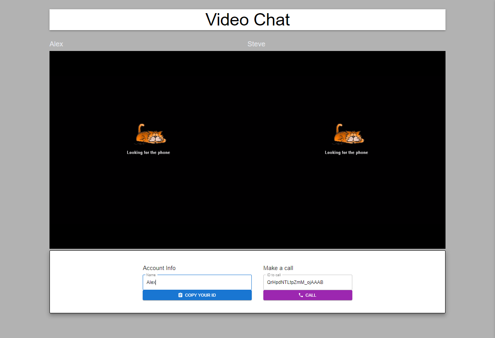

# Peer-to-Peer Video Chat Application

This project is a peer-to-peer video chat application developed using Next.js, Express.js, and socket.io. It enables real-time video communication between users in a simple and efficient manner. The project incorporates several key features to enhance functionality and user experience.


## Live Demo
You can access the live demo [here](https://video-chat-3nq7.onrender.com/).


## Features

- Real-Time Video Chatting: Users can initiate and participate in seamless real-time video chats, leveraging the power of peer-to-peer technology for direct communication.

- Next.js Frontend: The user interface is built using Next.js, a React framework that optimizes rendering, providing a smooth user experience.

- Express.js Backend: The Express.js backend handles API requests, routing, and server-side operations, facilitating client-server communication.

- Socket.io Integration: Socket.io enables real-time, bidirectional communication between clients and the server, playing a pivotal role in establishing and managing peer connections.

- MUI (Material-UI) Styling: The Material-UI library is used to ensure an attractive and responsive UI design across various devices.

- Copy to Clipboard Functionality: The react-copy-to-clipboard package enables users to conveniently copy and share video chat room links.

- Security with Helmet: The helmet package enhances security by setting appropriate HTTP headers, contributing to a more secure application.

- Peer Connection Management: The simple-peer library simplifies WebRTC peer connection management, easing the establishment of direct communication channels between users.

- CORS Handling: The cors package ensures secure communication between frontend and backend components through effective Cross-Origin Resource Sharing management.

- Environmental Configuration: The dotenv package simplifies environment variable management, improving security and configuration practices.

- Efficient Logging: The jet-logger package facilitates thorough logging, aiding in tracking application activities and debugging.

- File System Operations: The fs-extra package provides extended file system functionality, useful for managing temporary files or chat-related recordings.

- Client-Side Socket Management: The socket.io-client package manages socket connections on the client side, contributing to efficient communication and scalability.

## Getting Started

To run the project locally, follow these steps:

1. Clone the repository:

   ```shell
   git clone https://github.com/Emam546/Video_Chat
   ```
2. Install the dependencies:

   ```shell
   npm install
   ```

3. Start the development server:

    ```shell
   npm run dev
   ```
****